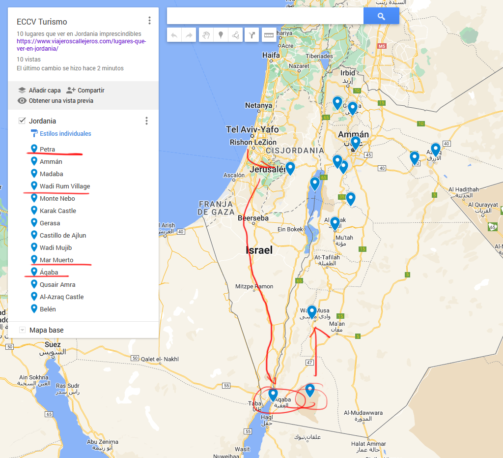

# Visitar Jordania e Israel (barato) en 2022  
La ruta a tomar es principalmente la siguiente:  
  
<iframe src="https://www.google.com/maps/d/u/0/embed?mid=1v_WqgxZg0bYP8SJ-1eqjP91VVuAzghk&ehbc=2E312F" width="640" height="480"></iframe>  

1. Avion España - Tel Aviv  
2. Viaje de Tel Aviv a Jerusalén  
3. De Jerusalén a Jordania, Frontera sur  Eliat/Aqaba  
4. Buceo en Aqaba  
5. De Aqaba a Wadi Rum  
6. De Wadi Rum a Petra  
7. De Petra a Amman o Vuelta a Tel Aviv via Aqaba  

