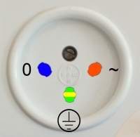
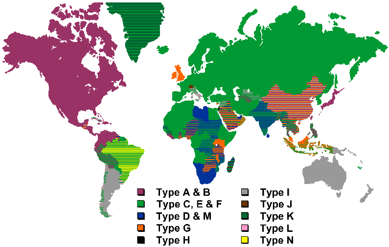
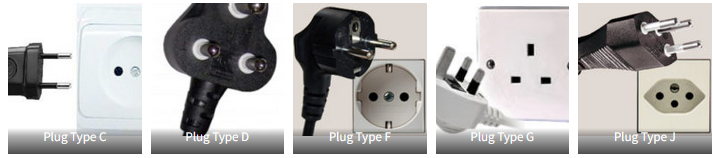

# Visitar Jordania e Israel (barato) en 2022  
La ruta a tomar es principalmente la siguiente:  
  
<iframe src="https://www.google.com/maps/d/u/0/embed?mid=1v_WqgxZg0bYP8SJ-1eqjP91VVuAzghk&ehbc=2E312F" width="640" height="480"></iframe>  

1. Avion España - Tel Aviv  
2. Viaje de Tel Aviv a Jerusalén  
3. De Jerusalén a Jordania, Frontera sur  Eliat/Aqaba  
4. Buceo en Aqaba  
5. De Aqaba a Wadi Rum  
6. De Wadi Rum a Petra  
7. De Petra a Amman o Vuelta a Tel Aviv via Aqaba  

##  El clima  

## Enchufes  
En Israel los enchufes son de tipo C y H. La corriente funciona a 230 V y 50 Hz (como en España). 
No Hace falta llevar adaptador ya que, aunque el más común de los enchufes es el H, es compatible con el C. 
Fuente [https://www.dcpowercord.com/type-h-plug.html](https://www.dcpowercord.com/type-h-plug.html
  
En Jordania es otro tema, si bien la tensión es 230 V utilizan enchufes tipo  C, D, F, G and J
Voy a suponer que se puede ir a pelo :) 

  
  

Las tarifas de todas los monumentos de Jordania se pueden consultar [Aquí](https://international.visitjordan.com/page/17/entrancefees.aspx)  

