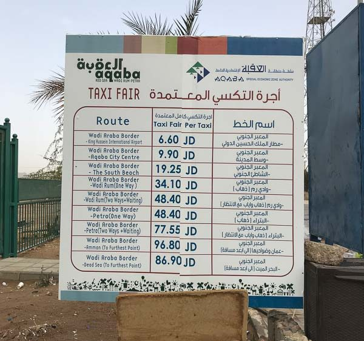

# Frontera Aqaba / Israel: Wadi Araba Border / Yitzhak Rabin  
Por ubicación me parece la frontera más llamativa. Está cerca de los principales monumentos y acarrea otras ventajas.  
Una de las razones principales para utilizar esta frontera es que si se pasan un par de noches en el país no es
necesario pagar las tasas de entrada. De esta forma nos podemos ahorrar unos 50 JD (70€) por persona.  

Un buen blog post al respecto (en ingles) [https://travelpixelz.com/blog/eilat-aqaba-border-crossing](https://travelpixelz.com/blog/eilat-aqaba-border-crossing)
La ciudad más cercana por el lado israelí es Eilat y la más cercana por el lado jordano es Aqaba.

##  Ventajas  
* Es la frontera más cercana a los principales monumentos.  
* No es necesario pagar las tasas de entrada: 
    * Más de 3 noches consecutivas en Jordania--> GRATIS  
    * Más de 2 noches consecutivas + visita a Petra --> GRATIS
    * Menos de 2 noches + petra 40 JD (55€)  
    * Menos de 2 noches + no petra 60 JD (85€)
* ADEMÁS Si no se pasan más de 3 noches en Jordania hay que pagar 10 JD de tasa de salida (en cualquier frontera).
# Lado de jordania  
## De la frontera a Aqaba  
* La frontera está a unos 10 km (20 minutos) en coche de Aqaba. La forma más fácil de llegar es en taxi. 
* Hay precios oficiales, pero los taxistas suelen pedir más. Ser educado e insistir en el precio oficial suele funcionar.  

  

##  Procedimientos a través del cruce fronterizo de South Wadi Araba
Una pagina aparentemente oficial es [aqaba.jo (ingles)](https://aqaba.jo/Pages/Viewpage/9/South_Wadi_Araba_Crossing_Boarder_Regulations) donde se pueden 
encontrar las siguientes regulaciones:  
Regulaciones fronterizas de cruce de South Wadi Araba

1. Complete el formulario  y verifíquelo en la oficina de enlace de la Autoridad de la Zona Económica
Especial de Aqaba (Ventana No. 13). Lleve dos copias del manifiesto y diríjase a (Ventana No. 8) para sellar el
manifiesto y su pasaporte.
2. Conserve su manifiesto verificado para enviarlo al salir del cruce fronterizo sur de Wadi Araba.
3. Cuando visite Petra, mantenga su boleto de entrada con usted y asegúrese de que su manifiesto esté sellado 
por la oficina de boletos de Petra.
4. Las siguientes tarifas no se cobrarán a la salida del cruce fronterizo sur de Wadi Araba en el caso de pasar
dos noches consecutivas en Jordania.
5. En el caso de visitar Petra y no pasar dos noches consecutivas en Jordania, se pagarán (40) JOD 
para la verificación del manifiesto al salir del cruce fronterizo sur de Wadi Araba.
6. En el caso de no pasar dos noches consecutivas en Jordania y no visitar Petra, se pagarán (60) JOD para la 
verificación del manifiesto y las tarifas de servicio a la salida del cruce fronterizo de Wadi Araba sur.
7. En el caso de salir de cualquier cruce fronterizo jordano que no sea el cruce fronterizo de South Wadi Araba, 
8. se aplicarán los procedimientos de la frontera de salida.

Puedes descargar el formulario en [Aquí](https://aqaba.jo/EchoBusV3.0/SystemAssets/PDFs/south%20wadi%20arba.pdf)  

