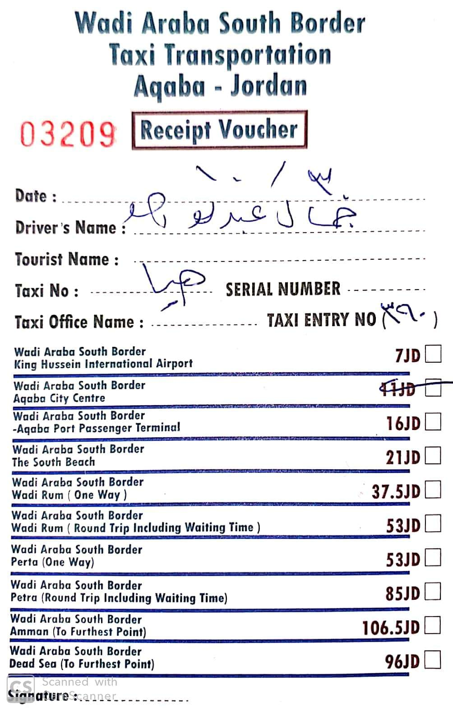
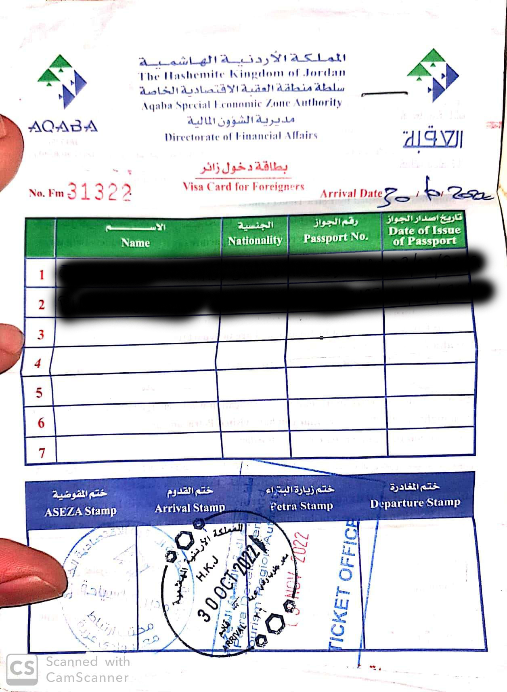

# Frontera Aqaba / Israel: Wadi Araba Border / Yitzhak Rabin 2022  
Por ubicación me parece la frontera más llamativa. Está cerca de los principales monumentos y acarrea otras ventajas.  
Una de las razones principales para utilizar esta frontera es que si se pasan un par de noches en el país no es
necesario pagar las tasas de entrada. De esta forma nos podemos ahorrar unos 50 JD (70€) por persona.  

Un buen blog post al respecto (en ingles) [https://travelpixelz.com/blog/eilat-aqaba-border-crossing](https://travelpixelz.com/blog/eilat-aqaba-border-crossing)
La ciudad más cercana por el lado israelí es Eilat y la más cercana por el lado jordano es Aqaba.

##  Ventajas  
* Es la frontera más cercana a los principales monumentos.  
* No es necesario pagar las tasas de entrada: 
    * Más de 3 noches consecutivas en Jordania--> GRATIS  
    * Más de 2 noches consecutivas + visita a Petra --> GRATIS
    * Menos de 2 noches + petra 40 JD (55€)  
    * Menos de 2 noches + no petra 60 JD (85€)
* ADEMÁS Si no se pasan más de 3 noches en Jordania hay que pagar 10 JD de tasa de salida (en cualquier frontera).
# Lado de jordania (2022)  
## De la frontera a Aqaba  
* La frontera está a unos 10 km (20 minutos) en coche de Aqaba. La forma más fácil de llegar es en taxi. 
* Hay precios oficiales, pero los taxistas suelen pedir más. Ser educado e insistir en el precio oficial suele funcionar.  

  
En general los precios son incluso más baratos que los oficiales. Un viaje Petra-Aqaba puede costar fácilmente 40 JD.
El viaje a Wadi Rum nos costó 25 JD.  
En general hay que negociar absolutamente todo, hasta el precio de la comida.  

##  Procedimientos a través del cruce fronterizo de South Wadi Araba
Realmente es muy sencillo, llegas al puesto fronterizo. Para salir de israel se paga una tasa de unos 104 NIS por 
persona. Se puede pagar con tarjeta. En ese momento te dan una papel que representa el fin de la VISA.  
Al llegar al lado jordano se rellena el siguiente formulario 
  
Te hacen un pequeño registro biometrico y te sellan el pasaporte y ya esta.

# Lado Israelí  
De lunes a jueves 6:30 am - 20:00  
Viernes y sábado 8:00 am - 20:00
## De la frontera al centro de Eilat  
La frontera se encuentra a unos 6 km (10 minutos) del centro de Eliat. Aproximadamente 40 NIS (unos 10-12€).  
##  Procedimientos a través del cruce fronterizo de South Wadi Araba  
* Control de pasaporte a la entrada  
* Tasa de salida 105 NIS (30€)
* Te dan un papelito de salida para adjuntar al pasaporte (en Israel no sellan los pasaportes)