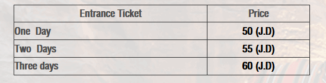

# Visitar Petra  
La pagina oficial es [https://visitpetra.jo](https://visitpetra.jo)  
Petra es mucho más que la simple pared de piedra que se ve en las fotos. Es toda una enorme ciudad milenaria. 
Se recomienda pasar varios días 2/3.  

# Tarifas y tickets  
El centro de visitantes abre de las 6:00 a las 18:00 en verano y de las 6:00 a las 16:00 en invierno.
Los tickets solo se pueden comprar presencialmente en el centro de visitantes. Varían en función de cuantos días se 
permanezca en Petra.  
Se pueden consultar en [Aquí](https://visitpetra.jo/Pages/viewpage.aspx?pageID=138)  

Para aquellos que permanezcan al menos una noche en Jordania:  
  

Para los que no pernoctan en Jordania son 90 JD.  
Si vas el primer día que visites Jordania te cobraran 90 JD (ya que no saben si te vas a ir ese mismo día o no) y al 
día siguiente te los devuelven.  

Para todos aquellos que no entren por la frontera de Eilat/Aqaba como se describe en el blog, es recomendable 
adquirir el [Jordan Pass](https://jordanpass.jo/)  que incluye las tasas de entrada a Jordania, se tramita el visado
online (no hay que hacer nada en la frontera) e incluye la entrada de Petra y otros lugares. Yo personamente no lo 
compré ya que vale unos 75 JD

Las tarifas de todas los monumentos de Jordania se pueden consultar [Aquí](https://international.visitjordan.com/page/17/entrancefees.aspx)  

# Como llegar y Dónde dormir  
La ciudad más cercana a petra es [Wadi Musa](https://www.google.com/maps/place/Centro+de+visitantes+de+Petra/@30.3227027,35.4750768,15z/data=!4m15!1m8!3m7!1s0x15016930021ab6b1:0xe43a697bc3a3e0b9!2sWadi+Musa,+Jordania!3b1!8m2!3d30.3216354!4d35.4801251!16s%2Fm%2F03nx74h!3m5!1s0x15016ecfe4a93d2f:0x8e7cb67c9e66a3f3!8m2!3d30.3243506!4d35.4678788!16s%2Fg%2F11rrz5r25). Muchos hoteles ofrecen
lanzaderas gratuito hasta Petra. En cualquier caso, un taxi puede costar unos 5 JD (6€).  
Para desplazarte hasta Petra desde Aqaba o Amman se puede coger un taxi o un autobús [https://www.jett.com.jo/en/](https://www.jett.com.jo/en/).
A día de hoy vale 15 JD. Alternativamente, se puede alquilar un coche o coger un taxi.  

# Es enorme, ¿Qué ver?  
He aquí la oficial página [Monumentos de Petra](https://visitpetra.jo/Pages/viewpage.aspx?pageID=157)  
No le voy a dar muchas vueltas al asunto, rec